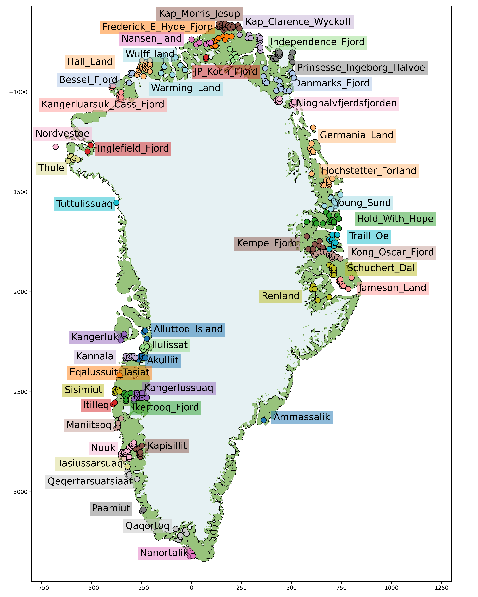
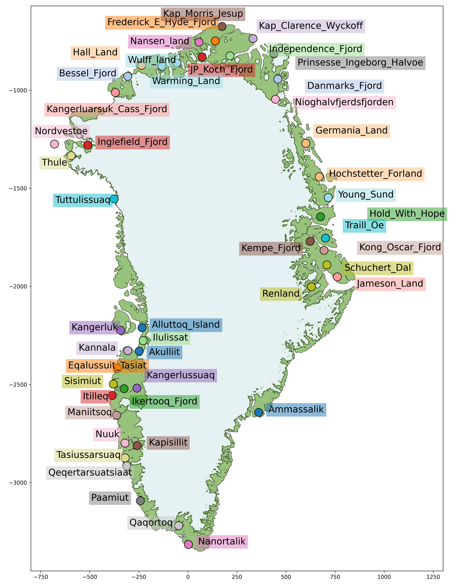

# Processing Relative Sea Level (RSL) Data for Greenland

This repository processes the RSL data from  https://github.com/evangowan/paleo_sea_level/  for the Greenland region and compiles it into a complete, unified dataset.

Each location contains a folder with a `calibrated.txt` file.  
These files follow the header structure shown below:

| LAB_ID | lat | lon | time | time_err | type | RSL | RSL_err_max | RSL_err_min |
|--------|-----|-----|------|----------|------|-----|-------------|-------------|

## Workflow

1. Download the original Greenland data.
2. Rename in the `.txt` files the data that have the same LAB_ID (there are only a few like UCIAMS-163890, K-1915, K-1916, OS-64844)
3. Run the file `process_GAPSLIP.py`, updating the file paths as needed.

## Output
After running the script, you will obtain:

- `rsl_dataset.nc`: Contains all available RSL measurements across Greenland, grouped by site in grid file coordinates (362 sites across 47 regions).

- `rsl_dataset_reduced.nc`: Contains all RSL measurements grouped by region in grid file coordinates. The coordinates of each region are the mean of the site coordinates, and all measurements within the region are concatenated.
Rename entries in the .txt files with duplicate LAB_IDs (there are only a few, e.g., UCIAMS-163890, K-1915, K-1916, OS-64844).

