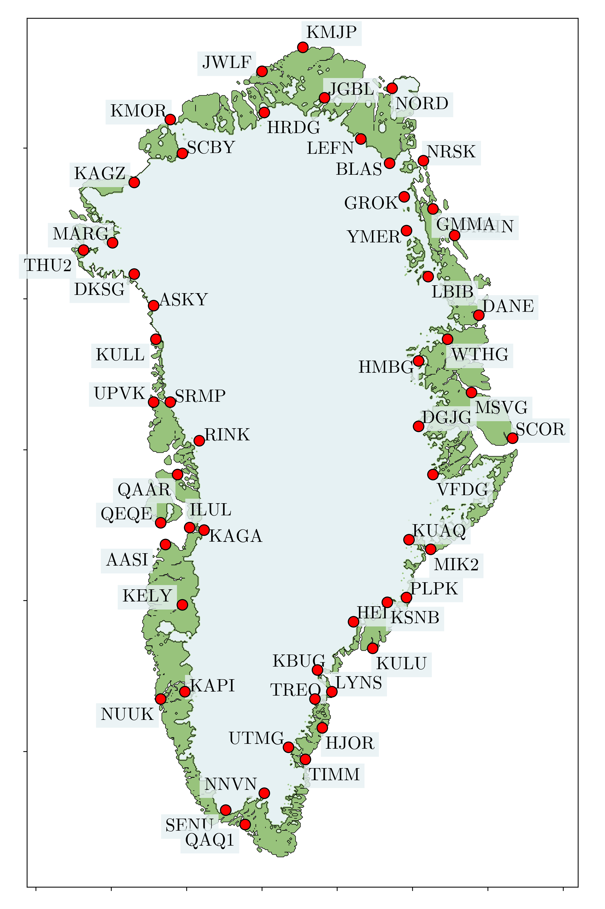

# GIA measurements in Greenland

This repository contains a .nc dataset with the GIA uplift rates v_vert and their standard deviation std for the stations located within the Greenland domain, based on Schumacher et al. (2018) (doi: https://doi.org/10.1093/gji/ggy235).

You can build the dataset by downloading the original data (https://doi.pangaea.de/10.1594/PANGAEA.889923) and running the following script:

```
python3.12 process_schumacher2018.py
```
This will generate the processed dataset and a map showing all the locations where the measurements from Schumacher et al. (2018) were taken:

